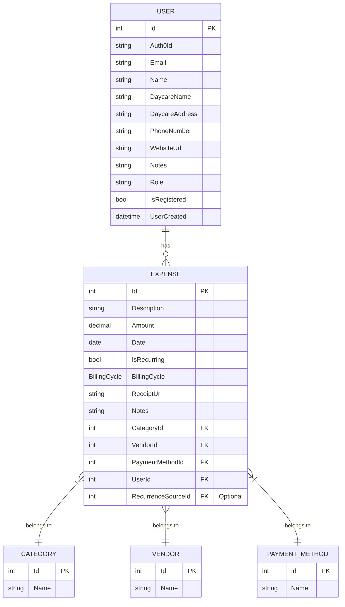

# CloudCare API

CloudCare is a comprehensive, enterprise-grade solution designed to streamline daycare management. This repository contains the backend REST API, which powers the CloudCare platform. The API is built with .NET 9.0 and C#, following modern software architecture principles and best practices for security, scalability, and maintainability.

The live API is deployed in a secure, segmented network within my personal homelab, running on a RHEL VM behind a Traefik reverse proxy.

## About The Project

This project was born out of a real-world need identified while volunteering at a local daycare. The initial prototype, a simple Python script, has been completely re-architected and rewritten into a robust, full-stack application. This evolution reflects my growth as a software engineer, applying industry best practices learned through co-op experiences to build a secure, scalable, and feature-rich platform.

The backend is a monolithic ASP.NET Core Web API that serves a React frontend. It handles everything from user authentication and expense tracking to automated attendance logging via a custom facial recognition system.

## Key Features

-   **Expense Management:** Full CRUD functionality for tracking daycare expenses.
-   **Recurring Expenses:** Automated creation of recurring expenses based on customizable billing cycles (weekly, monthly, etc.).
-   **User Management:** Secure user registration and profile management.
-   **Data Lookups:** Endpoints to manage and retrieve categories, vendors, and payment methods.
-   **Authentication:** Secured with Auth0, using JWT Bearer tokens for authentication.
-   **Observability:** Integrated with an OpenTelemetry collector to provide logs, metrics, and traces to a Grafana dashboard for monitoring and debugging.

## Built With

-   **.NET 9.0**
-   **C#**
-   **ASP.NET Core Web API**
-   **Entity Framework Core**
-   **PostgreSQL** (for production)
-   **Docker**
-   **Auth0** for authentication
-   **xUnit** for testing
-   **AutoMapper**
-   **OpenTelemetry** for observability

## Architecture

The API follows a clean, layered architecture that separates concerns and promotes maintainability:

-   **Controllers:** Handle incoming HTTP requests, validate input, and return responses.
-   **Services:** Contain the core business logic of the application.
-   **Repositories:** Abstract the data access logic, interacting with the database via Entity Framework Core.

This project utilizes the **Repository/Service pattern** to ensure a clear separation of concerns and to make the application easier to test and maintain.

### Entity Relationship Diagram (ERD)

The following diagram illustrates the relationships between the core entities in the database:



## API Endpoints

The API provides the following endpoints:

| Endpoint                        | Method | Description                                      |
| ------------------------------- | ------ | ------------------------------------------------ |
| `/api/users/register`           | POST   | Registers a new user.                            |
| `/api/users/exists`             | GET    | Checks if a user exists based on Auth0 ID.       |
| `/api/expenses`                 | GET    | Retrieves all expenses for the authenticated user. |
| `/api/expenses/{id}`            | GET    | Retrieves a specific expense by ID.              |
| `/api/expenses`                 | POST   | Creates a new expense.                           |
| `/api/expenses/{id}`            | PUT    | Updates an existing expense.                     |
| `/api/expenses/{id}`            | DELETE | Deletes an expense.                              |
| `/api/categories`               | GET    | Retrieves all expense categories.                |
| `/api/vendors`                  | GET    | Retrieves all vendors.                           |
| `/api/paymentmethods`           | GET    | Retrieves all payment methods.                   |

Swagger is enabled in the development environment for interactive API documentation and testing.

## CI/CD Pipeline

This project utilizes a sophisticated CI/CD pipeline powered by GitHub Actions to automate the build, test, and deployment process.

The pipeline consists of three main jobs:

1.  **Build & Test:**
    -   Triggered on every push or pull request to the `main` branch.
    -   Builds the .NET project in `Release` configuration.
    -   Runs `dotnet format` to ensure code style consistency.
    -   Executes all unit tests using xUnit.

2.  **Publish Docker Image:**
    -   If the `build-test` job succeeds, this job logs into Docker Hub.
    -   Builds and pushes two tagged Docker images:
        -   `hashirowais/cloudcare-api:latest` and `hashirowais/cloudcare-api:<commit-sha>` for the main application.
        -   `hashirowais/cloudcare-api:migrator-latest` which is a dedicated image for running database migrations.

3.  **Trigger Deployment:**
    -   After the images are published, this job triggers a deployment in the production environment.
    -   It checks out a separate GitOps repository (`hashirowais/cloudcare-deploy`).
    -   It updates a file in the repository to signal the deployment tool (Dokploy) to pull the new image and redeploy the application.

This automated workflow ensures that every change is tested and deployed reliably, minimizing manual intervention and accelerating the development cycle.

## Testing

The project includes a dedicated test suite using **xUnit** to ensure the reliability of the business logic. The tests are focused on the service layer, using a **mock repository** (`MockExpenseRepository`) to isolate the services from the database and enable true unit testing.

The tests cover various scenarios for the recurring expense logic, which is a critical component of the application.

## Getting Started

To get a local copy up and running, follow these simple steps.

### Prerequisites

-   [.NET 9.0 SDK](https://dotnet.microsoft.com/download/dotnet/9.0)
-   [Docker](https://www.docker.com/products/docker-desktop)
-   An Auth0 account for authentication.

### Installation

1.  **Clone the repo**
    ```sh
    git clone https://github.com/HashirOwais/CloudCare.git
    ```
2.  **Navigate to the API directory**
    ```sh
    cd API/CloudCare_API
    ```
3.  **Set up environment variables**
    Create a `.env` file in the `CloudCare-API/CloudCare.API` directory and add the following variables:
    ```
    AUTH0_AUTHORITY=<YOUR_AUTH0_AUTHORITY>
    AUTH0_AUDIENCE=<YOUR_AUTH0_AUDIENCE>
    CONNECTION_STRING=<YOUR_POSTGRESQL_CONNECTION_STRING>
    OTEL_ENDPOINT=<YOUR_OTEL_COLLECTOR_ENDPOINT>
    ```
4.  **Restore dependencies**
    ```sh
    dotnet restore CloudCare-API/CloudCare.API.sln
    ```
5.  **Run the application**
    ```sh
    dotnet run --project CloudCare-API/CloudCare.API
    ```

The API will be available at `https://localhost:5001`.

## Contact

Hashir Owais - [hashir15@hotmail.com](mailto:hashir15@hotmail.com)

Project Link: [https://github.com/HashirOwais/CloudCare](https://github.com/HashirOwais/CloudCare)