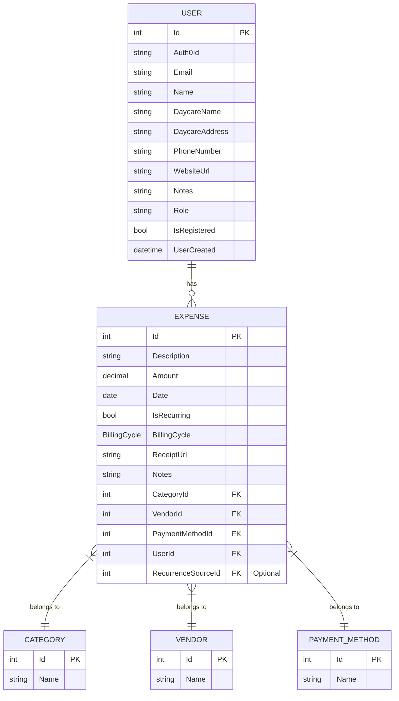

# CloudCare Suite - Monorepo

Welcome to the CloudCare Suite monorepo. CloudCare is a comprehensive, enterprise-grade solution designed to streamline daycare management. This repository now consolidates all core components of the CloudCare platform, including the backend API and the web frontend, into a single, manageable monorepo.

The live API is deployed in a secure, segmented network within my personal homelab, running on a RHEL VM behind a Traefik reverse proxy.

## About The Project

This project was born out of a real-world need identified while volunteering at a local daycare. The initial prototype, a simple Python script, has been completely re-architected and rewritten into a robust, full-stack application. This evolution reflects my growth as a software engineer, applying industry best practices learned through co-op experiences to build a secure, scalable, and feature-rich platform.

## Architecture

This project is structured as a .NET monorepo, which centralizes development and simplifies dependency management across the different parts of the application. The current architecture consists of several key components:

-   **`CloudCare.API`**: The core backend REST API built with ASP.NET Core. It handles all business logic, data processing, and communication with the database.
-   **`CloudCare.Web`**: A modern frontend application built with **Blazor WebAssembly**, providing a rich and interactive user experience that runs directly in the browser.
-   **`CloudCare.Business`**: A shared class library containing core business logic, services, and DTOs.
-   **`CloudCare.Data`**: A shared class library responsible for data access, containing the Entity Framework Core DbContext, models, and repository implementations.

This compact, library-based approach improves code reuse and maintainability.

### Future Direction
The long-term vision for CloudCare is to evolve this architecture towards a more distributed **microservices model**. This will allow for greater scalability, independent deployments, and technological flexibility for each service.

## Key Features

-   **Expense Management:** Full CRUD functionality for tracking daycare expenses.
-   **Recurring Expenses:** Automated creation of recurring expenses based on customizable billing cycles.
-   **User Management:** Secure user registration and profile management.
-   **Data Lookups:** Endpoints to manage and retrieve categories, vendors, and payment methods.
-   **Authentication:** Secured with Auth0, using JWT Bearer tokens for authentication.
-   **Observability:** Integrated with an OpenTelemetry collector to provide logs, metrics, and traces to a Grafana dashboard for monitoring and debugging.

## Built With

-   **.NET 10**
-   **C#**
-   **ASP.NET Core Web API**
-   **Blazor WebAssembly**
-   **Entity Framework Core**
-   **PostgreSQL** (for production & local development)
-   **Docker & Docker Compose**
-   **Auth0** for authentication
-   **xUnit** for testing
-   **AutoMapper**
-   **OpenTelemetry** for observability

## Entity Relationship Diagram (ERD)

The following diagram illustrates the relationships between the core entities in the database:



## CI/CD Pipeline

This project utilizes a CI/CD pipeline powered by GitHub Actions. On every push to `main`, the pipeline automatically:
1.  **Restores, builds, and tests** the entire .NET solution to ensure code quality and correctness.
2.  **Builds and pushes** a new Docker image for the `CloudCare.API` to Docker Hub, tagged with `latest` and the commit SHA.
3.  **Triggers a deployment** in the production homelab environment by updating a GitOps repository, which signals Dokploy to pull the new image and redeploy the application.

This automated workflow ensures that every change is validated and deployed reliably.

## Getting Started

To get a local copy of the backend services up and running, follow these steps.

### Prerequisites

-   [.NET 10 SDK](https://dotnet.microsoft.com/download/dotnet/10.0)
-   [Docker Desktop](https://www.docker.com/products/docker-desktop)
-   An Auth0 account for authentication.

### Installation & Running

1.  **Clone the repo**
    ```sh
    git clone https://github.com/HashirOwais/CloudCare.git
    cd CLOUDCARE/cloudcare_mono_repo
    ```
2.  **Set up environment variables**
    Create a `.env` file in the root of the `cloudcare_mono_repo` directory. You can copy the `.env.example` file if it exists. Populate it with your secrets:
    ```
    DB_CONN=Server=postgres-db;Database=cloudcare;User Id=postgres;Password=postgres;
    AUTH0_AUTHORITY=<YOUR_AUTH0_AUTHORITY>
    AUTH0_AUDIENCE=<YOUR_AUTH0_AUDIENCE>
    OTEL_ENDPOINT=<YOUR_OTEL_COLLECTOR_ENDPOINT>
    ```
3.  **Run with Docker Compose**
    The easiest way to run the backend API and the PostgreSQL database is with Docker Compose.
    ```sh
    docker-compose up --build
    ```
    The API will be available at `http://localhost:5001`.

4.  **Running the Blazor Frontend**
    To run the frontend, you will need to navigate to its directory and run it separately.
    ```sh
    cd src/CloudCare.Web
    dotnet run
    ```

## Contact

Hashir Owais - [hashir15@hotmail.com](mailto:hashir15@hotmail.com)

Project Link: [https://github.com/HashirOwais/CloudCare](https://github.com/HashirOwais/CloudCare)
