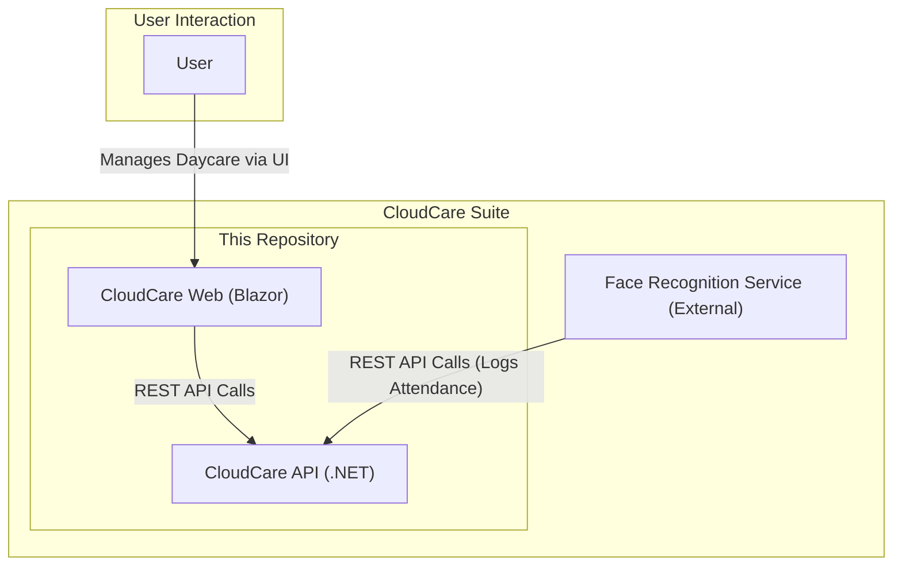
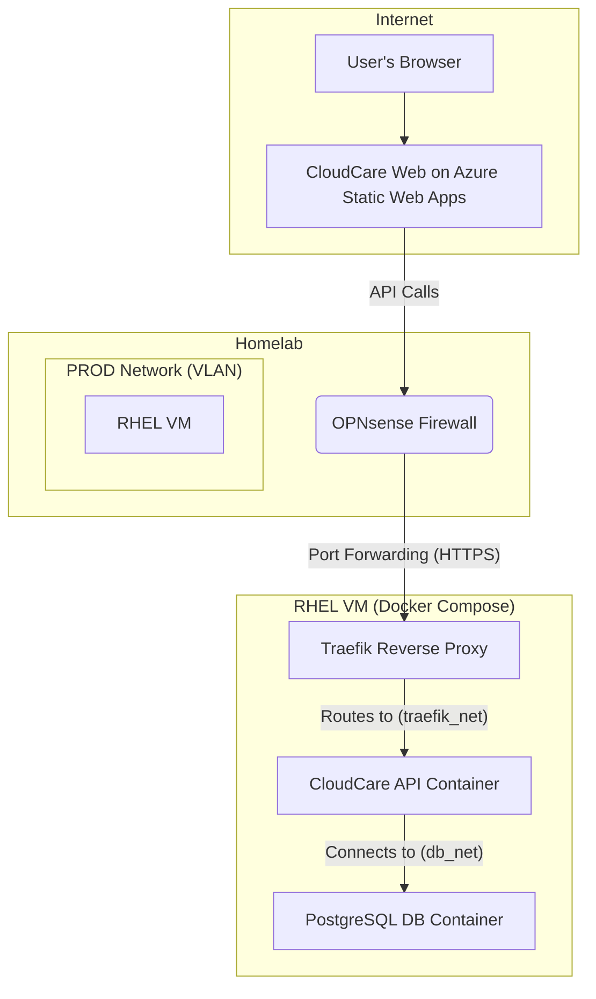
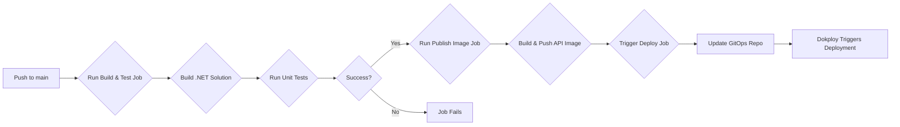

# CloudCare Suite

Welcome to the CloudCare Suite repository. CloudCare is a comprehensive, enterprise-grade solution designed to streamline daycare management. This repository contains the core components of the CloudCare platform, including the backend API and the web frontend, structured as a .NET monorepo.

**Visit the live application here:** [cloudcare.hashirowais.com](https://cloudcare.hashirowais.com)

## About The Project

This project was born out of a real-world need identified while volunteering at a local daycare. The initial prototype, a simple Python script, has been completely re-architected and rewritten into a robust, full-stack application. This evolution reflects my growth as a software engineer, applying industry best practices learned through co-op experiences to build a secure, scalable, and feature-rich platform.

## Architecture Overview

The CloudCare suite is composed of three main components: a web front-end, a back-end API, and a face recognition service. The API and the new Blazor Web App are developed together in this monorepo to streamline development, while the Face Recognition Attendance System remains a separate, standalone service.



### Future Direction
The long-term vision for CloudCare is to evolve this architecture towards a more distributed **microservices model**. This will allow for greater scalability, independent deployments, and technological flexibility for each service.

---

## Components

### 1. CloudCare API

The core backend REST API that handles all business logic, data processing, and communication with the database.

*   **Purpose:** Provides a RESTful API for managing users, expenses, and other daycare-related data.
*   **Key Technologies:**
    *   **Framework:** .NET 10 (ASP.NET Core)
    *   **Database:** Entity Framework Core with PostgreSQL
    *   **Authentication:** Auth0 & JWT Bearer Tokens
    *   **Testing:** xUnit
    *   **Observability:** OpenTelemetry

### 2. CloudCare Web

A modern frontend application providing a rich and interactive user experience that runs directly in the browser.

*   **Purpose:** Provides the primary user interface for daycare staff and administrators.
*   **Key Technologies:**
    *   **Framework:** Blazor WebAssembly
    *   **Language:** C#
    *   **Authentication:** OIDC Client
    
### 3. Shared Libraries

To promote code reuse and maintainability, the solution uses several shared class libraries.
*   **`CloudCare.Business`**: Contains core business logic, services, and DTOs.
*   **`CloudCare.Data`**: Responsible for data access, containing the Entity Framework Core DbContext, models, and repository implementations.

### 4. Face Recognition Attendance System (External)

A standalone Python service that provides real-time face recognition for automated attendance tracking.

*   **GitHub Repository:** [https://github.com/HashirOwais/Face_Recognition_Attendance_System.git](https://github.com/HashirOwais/Face_Recognition_Attendance_System.git)
*   **Purpose:** Captures video, recognizes faces, and sends attendance data to the CloudCare API.
*   **Key Technologies:** Python, OpenCV, DeepFace.

---

## Deployment

The CloudCare suite utilizes a hybrid deployment model, with the front-end hosted on **Azure Static Web Apps** and the back-end services running in a private homelab environment.

### Backend Homelab Architecture

The backend API is self-hosted in a homelab environment, ensuring full control over the infrastructure and data. The deployment is carefully segmented for security and managed using Docker.



**Architecture Breakdown:**

1.  **Firewall and Network:** An **OPNsense firewall** acts as the edge device. A dedicated `prod` VLAN is configured to isolate all production services.
2.  **Virtual Machine:** A **Red Hat Enterprise Linux (RHEL) VM** is the host for all backend services.
3.  **Reverse Proxy:** **Traefik** runs as a Docker container and serves as the reverse proxy. It handles incoming HTTPS traffic, manages SSL certificates, and routes requests to the appropriate backend service.
4.  **Containerization:** The entire backend stack is managed via **Docker Compose**.
5.  **Network Segmentation:** To enhance security, two separate Docker networks are used:
    *   `traefik_net`: This network is shared by Traefik and the **CloudCare API**. Traefik uses this network to forward requests to the API container.
    *   `db_net`: This network is exclusively for the **CloudCare API** and the **PostgreSQL database**. This setup ensures that the database container is not accessible from the reverse proxy or any other external-facing network, strictly limiting its access to the API container.

This setup provides a robust and secure environment for the backend services, separating concerns and minimizing the attack surface.

## CI/CD Pipeline

This repository features a comprehensive CI/CD pipeline using GitHub Actions to automate the build, test, and deployment process.



**Pipeline Stages:**

1.  **Build and Test:** On every push to the `main` branch, the pipeline checks out the code, builds the entire .NET solution, and executes all unit tests.
2.  **Publish Docker Image:** If the build and tests are successful, the pipeline logs into Docker Hub and pushes the `CloudCare.API` image, tagged as `latest` and with the commit SHA.
3.  **Trigger Deployment:** After the image is published, the pipeline triggers a deployment by pushing a commit to a separate GitOps repository (`hashirowais/cloudcare-deploy`), which is monitored by Dokploy.

## Getting Started

To get a local copy of the backend services up and running, follow these steps.

### Prerequisites

-   [.NET 10 SDK](https://dotnet.microsoft.com/download/dotnet/10.0)
-   [Docker Desktop](https://www.docker.com/products/docker-desktop)
-   An Auth0 account for authentication.

### Installation & Running

1.  **Clone the repository**
    ```sh
    git clone https://github.com/HashirOwais/CloudCare_API.git
    cd CloudCare_API
    ```
2.  **Set up environment variables**
    Create a `.env` file in the root of the repository. You can copy the `.env.example` file if it exists. Populate it with your secrets:
    ```
    DB_CONN=Server=postgres-db;Database=cloudcare;User Id=postgres;Password=postgres;
    AUTH0_AUTHORITY=<YOUR_AUTH0_AUTHORITY>
    AUTH0_AUDIENCE=<YOUR_AUTH0_AUDIENCE>
    OTEL_ENDPOINT=<YOUR_OTEL_COLLECTOR_ENDPOINT>
    ```
3.  **Run with Docker Compose**
    The easiest way to run the backend API and the PostgreSQL database is with Docker Compose.
    ```sh
    docker-compose up --build
    ```
    The API will be available at `http://localhost:5001`.

4.  **Running the Blazor Frontend**
    To run the frontend, you will need to navigate to its directory in a separate terminal and run it.
    ```sh
    cd src/CloudCare.Web
    dotnet run
    ```

## Contact

Hashir Owais - [howais.dev@gmail.com](mailto:howais.dev@gmail.com)
If you encounter any bugs or have any issues, please feel free to use the Issues tab to report them.
